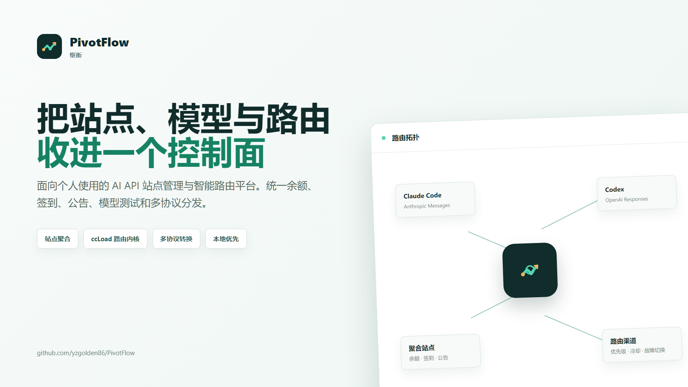
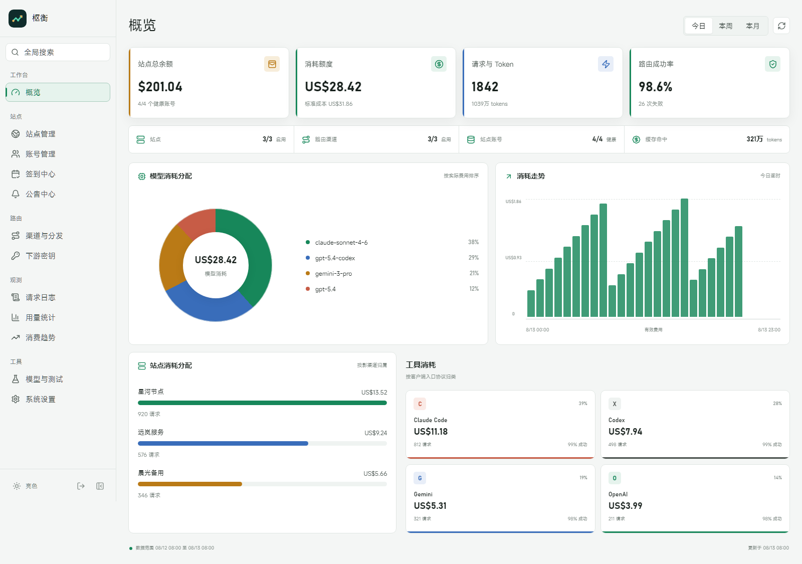
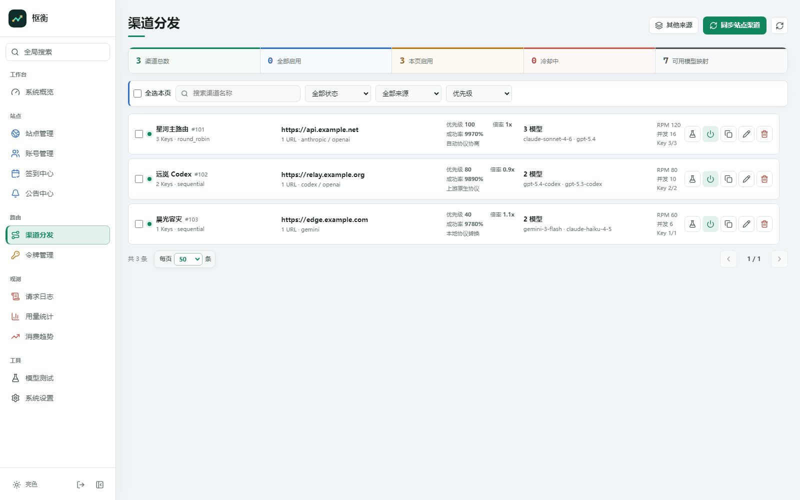

# PivotFlow

[简体中文](README.zh-CN.md) · [Documentation](docs/README.md)

PivotFlow is a personal AI API site manager and intelligent routing console. It brings upstream accounts, balances, check-ins, announcements, and model inventories into one interface while retaining PivotFlow's proven routing core: multiple keys and URLs, priorities, protocol conversion, cooldowns, and failover.

PivotFlow is the product and the routing foundation is integrated into the same application.



## What it does

### Site control plane

- Detect and classify upstream sites.
- Store account credentials encrypted at rest.
- Refresh balances and display balance changes after check-in.
- Run check-ins and retain account-level history.
- Discover models and test a model directly with a site account.
- Aggregate announcements and track read state.
- Send generic webhooks for low balances and check-in failures.
- Project site accounts into idempotently managed routing channels.

### PivotFlow routing data plane

- OpenAI Chat Completions, OpenAI Responses, Anthropic Messages, Gemini, and Codex ingress.
- Model-based channel selection with priority, key strategy, and URL scheduling.
- Key-, model-, and channel-level cooldowns.
- Classified failover for authentication errors, rate limits, upstream failures, timeouts, and interrupted streams.
- Local conversion, native upstream protocol, and automatic protocol negotiation.
- RPM, concurrency, cost multiplier, daily limit, WebSocket, and request-log controls.



### Operations

- Dashboard for balances, spend, model distribution, site distribution, and client tools.
- Request logs, usage statistics, cost trends, and active requests.
- Recoverable downstream API keys with model, channel, cost, and concurrency restrictions.
- Codex OAuth, Antigravity OAuth, and credential-file import.
- SQLite, MySQL, PostgreSQL, and hybrid primary-database/SQLite storage.
- Themes, routing, cooldown, logging, notification, and read-only upstream version settings.

## Four concepts

| Concept | Contains | Used for |
| --- | --- | --- |
| Site | Base URL, platform, timezone, and proxy | Identifying one upstream service |
| Account | Credentials and state under a site | Balance, check-in, models, and announcements |
| Channel | URL, keys, models, and routing policy | Serving downstream proxy requests |
| Downstream key | A PivotFlow-issued token and restrictions | Authenticating Claude Code, Codex, Gemini, or OpenAI clients |

Accounts and channels are not two independent copies of the same setup. Add the account under a site, then use **Sync site channels**. PivotFlow discovers routing keys and models and creates or updates a source-bound channel. Use a manual channel only for an upstream that cannot be managed as a site.

See [Core concepts](docs/concepts.md) and [Routing](docs/routing.md) for projection and multi-key behavior.

## Provider support

| Provider | Balance | Models | Announcements | Server check-in | Notes |
| --- | :---: | :---: | :---: | :---: | --- |
| New API / One API family | Yes | Yes | Yes | Yes | Exact behavior depends on the deployed fork |
| AnyRouter | Yes | Yes | Yes | Yes | Access token or session cookie with user ID; browser assistance may be required |
| Veloera | Yes | Yes | Yes | Yes | Uses its dedicated user and check-in contracts |
| Sub2API | Yes | Yes | Yes | No | Server-side check-in is explicitly unsupported today |
| OneHub / DoneHub / VoAPI / AxonHub | Compatible | Compatible | Compatible | Varies | Works only where the deployment preserves the New API / One API contract |

“Supported” means that PivotFlow contains an adapter and contract tests. A third-party deployment may still disable endpoints, require different permissions, or diverge from its upstream project.

## Quick start

### Docker Compose

```bash
cp .env.docker.example .env
# Set at least PIVOTFLOW_PASS in .env
docker compose pull
docker compose up -d
```

On PowerShell, use `Copy-Item .env.docker.example .env`. This uses the published `ghcr.io/yzgolden86/pivotflow:latest` image. If GHCR asks for authentication, run `docker login ghcr.io` with your GitHub username and a personal access token that has `read:packages`; a GitHub account password is not accepted. The account must also have access to the package. Open `http://127.0.0.1:8080/web/auth/` and sign in with `PIVOTFLOW_PASS`.

If the published image is not available to your account, build the current checkout instead:

```bash
docker compose -f docker-compose.build.yml up -d --build
```

The published-image Compose file bind-mounts `./data`; the build Compose file uses a Compose-managed Docker volume whose logical name is `pivotflow_data`. They are independent data stores, so switching can appear to start with an empty database. Read [Security and backup](docs/security.md) before migrating the database and credential master key.

### Build from source

```bash
cp .env.example .env
go build -tags sonic -o pivotflow .
./pivotflow
```

The default port is `8080`; set `PORT` to change it. Go `1.26` and Node.js `24` are used by the current build and CI configuration.

## First setup

1. Review storage, request limits, cooldowns, and logs under **System settings**.
2. Add an upstream under **Sites** and optionally create its first account in the same form.
3. Verify the credential, refresh the balance, and synchronize models under **Accounts**.
4. Run one manual check-in under **Check-in center**.
5. Use **Sync site channels** under **Channels and routing**, then inspect URL, model, key count, and priority.
6. Create a token under **Downstream keys** and configure it in your client.
7. Run one account or channel probe under **Models and testing** before real traffic.

## Proxy endpoints

The proxy surface is the server's `/v1/*` route:

```text
OpenAI Chat Completions  http://127.0.0.1:8080/v1/chat/completions
OpenAI Responses         http://127.0.0.1:8080/v1/responses
Anthropic Messages       http://127.0.0.1:8080/v1/messages
Gemini                   http://127.0.0.1:8080/v1beta/models/{model}:generateContent
Codex                    http://127.0.0.1:8080/v1/responses
```

Clients receive a PivotFlow downstream key. Upstream credentials stay in site accounts or channels and should never be copied into client configuration.

## Security

- Set a strong admin password and never commit `.env`, databases, master keys, cookies, OAuth credentials, or API keys.
- Site credentials and webhook URLs are encrypted. A personal SQLite deployment creates `fusion-master.key` beside the database when no explicit key is configured. Back up the database and that key together.
- Use either `FUSION_MASTER_KEY` or `FUSION_MASTER_KEY_FILE`. Keep production key material outside the repository.
- `PIVOTFLOW_ALLOW_INSECURE_TLS=1` is a temporary diagnostic switch, not a production setting.
- Admin APIs require a login session; proxy APIs require a downstream key.

Read [Security and backup](docs/security.md) before migrating or restoring data.

## Documentation

- [Documentation index](docs/README.md)
- [Getting started](docs/getting-started.md)
- [Core concepts](docs/concepts.md)
- [Site management](docs/site-management.md)
- [Routing](docs/routing.md)
- [Model testing](docs/model-testing.md)
- [Configuration](docs/configuration.md)
- [Deployment](docs/deployment.md)
- [Security and backup](docs/security.md)
- [Maintenance and PivotFlow sync policy](docs/maintenance.md)
- [Troubleshooting](docs/troubleshooting.md)

## Architecture and provenance

PivotFlow maintains the site control plane, admin API, storage, and console. The PivotFlow selector, cooldown, key/URL scheduling, and proxy path remain the routing foundation. `internal/protocol/cliproxy` is a pinned snapshot of the pure conversion core documented in [UPSTREAM.md](internal/protocol/cliproxy/UPSTREAM.md).

Upstream releases never overwrite PivotFlow automatically. They are reviewed, ported, and tested according to [Maintenance](docs/maintenance.md).

## Verification

```bash
go test -tags sonic ./internal/...
make verify-web
go test ./internal/antigravityauth -count=1
```

Frontend development:

```bash
cd console
npm ci
npm run dev
```

## License

MIT, see [LICENSE](LICENSE). Third-party provenance and retained notices are documented alongside the corresponding code. Use PivotFlow only with upstream services and accounts you are authorized to access.

## Acknowledgements

PivotFlow stands on the work and ideas of the open-source community. Special thanks to:

- [ccLoad](https://github.com/caidaoli/ccLoad) for the routing, scheduling, cooldown, failover, and protocol-conversion foundation retained by PivotFlow.
- [Metapi](https://github.com/cita-777/metapi) for its site aggregation, account workflows, and dashboard ideas.
- [All API Hub](https://github.com/qixing-jk/all-api-hub) for its multi-site asset management, provider compatibility, and interaction design references.
- [Octopus](https://github.com/Hureru/octopus) for its personal gateway, channel management, and concise console design ideas.
- [Sub2API](https://github.com/Wei-Shaw/sub2api) and [New API](https://github.com/QuantumNous/new-api) for their upstream contracts, ecosystem conventions, and management workflows.

Thanks to every maintainer and contributor who made these projects available to the community. References and acknowledgements do not replace the licenses and copyright notices of their respective projects.

**学 AI，上 [LINUX.DO](https://linux.do)。**
